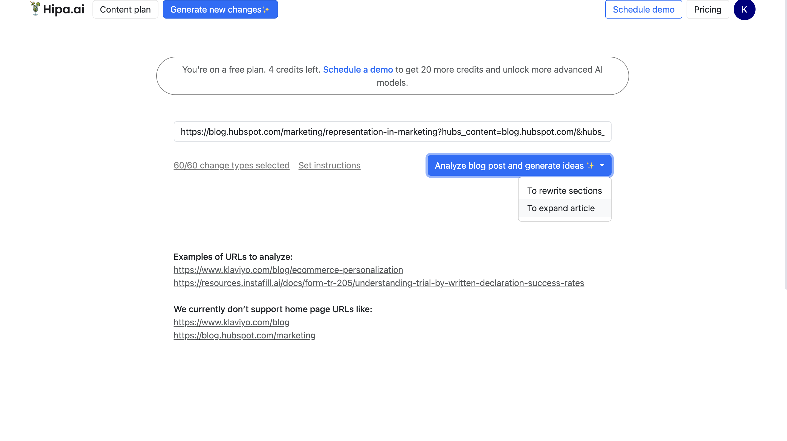

# How to connect custom integration to Hipa.ai: Step-by-step guide

1. Provide an article url at https://hipa.ai/suggestions/new page. Select modification type from dropdown list and start ideas generation.



2. Once ideas are generated, select the idea and generate changes using AI model from the available options.
   


3. After changes are generated, click on the 'Publish suggested changes...' dropdown and choose 'Connect site to automatically publish changes' option.


4. Modal window will apear after option click, where 'Custom Webhook' integration type needs to be selected. In the 'Webhook URL' input, enter a site URL that will accept HTTP request after the changes are published. Click 'Connect' button.


5. Then click on the 'Publish suggested changes...' dropdown again and you will see 'Publish changes immediately' option. Select this option If you want generated changes to be applied.
When this option is clicked, an HTTP POST request will be made to the site webhook URL defined in the previous step, with json body of this structure:
```json
{
  "new_content": "<updated html of a web page>",
  "url": "<web page url>",
}
```


   
